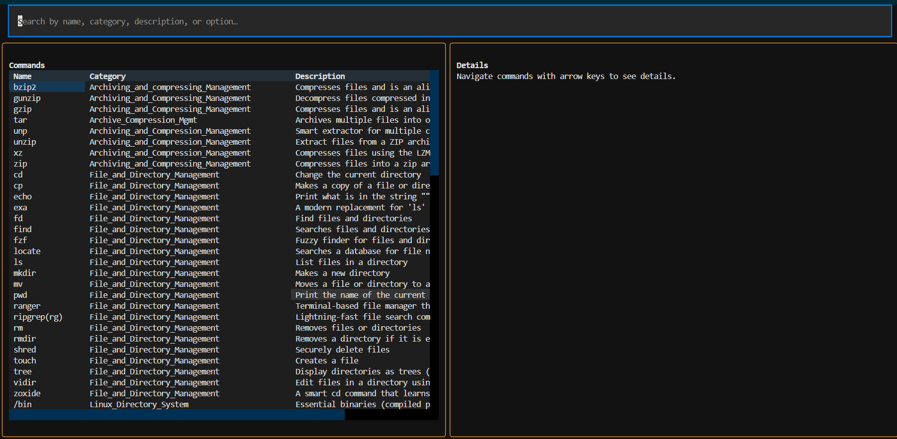

<p align="center">
  
</p>

# 🐧 LCL

A comprehensive Terminal User Interface (TUI) application for browsing and searching Linux commands with a beautiful, professional interface.

<p align="center">
  
</p>

## 🌟 Features

- **📚 180+ Linux Commands** - Comprehensive database organized by category
- **🔍 Lightning-Fast Search** - Real-time search by command name, category, or options  
- **📖 Rich Details** - View command syntax, options, examples, and descriptions
- **🎨 Beautiful TUI** - Professional orange-themed interface with smooth animations
- **⌨️ Full Keyboard Navigation** - Tab through all interface elements seamlessly
- **👑 Admin Features** - Template generation for command maintainers
- **🛡️ Robust Error Handling** - Graceful handling of malformed data

## 📸 Screenshots

### Main Interface
<p align="center">
  
</p>

### Search Results
<p align="center">
  
</p>

### Command Details
<p align="center">
  
</p>

### Menu System
<p align="center">
  
</p>
## 🚀 Quick Start

### Installation via pipx (Recommended)
```bash
pipx install lcl
lcl
# 🐧 LCL

